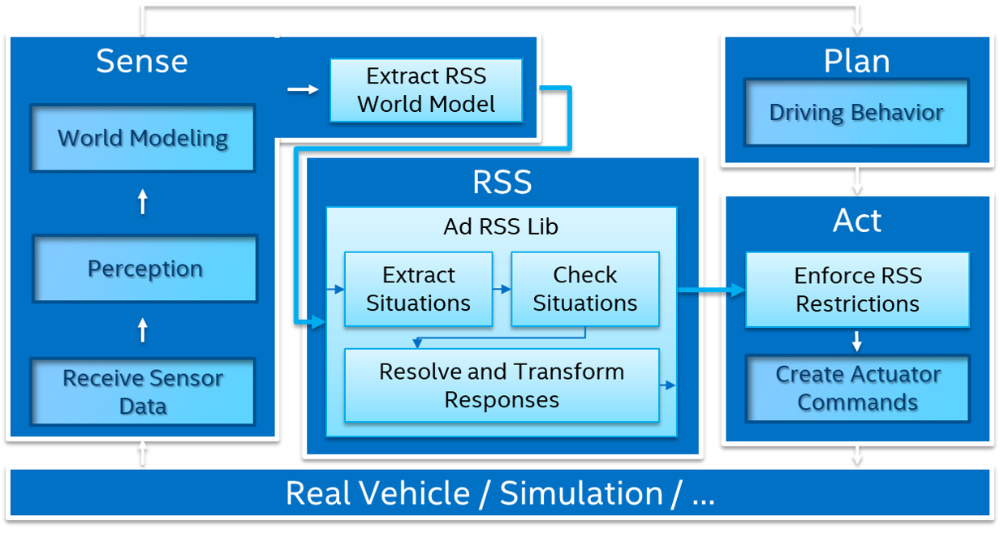
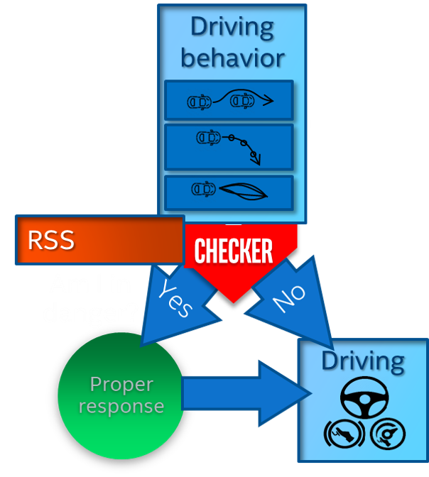

# RSS System Architecture Overview

This section sketches the integration of RSS into a exisiting system architecture.

## Overview: Sense, Plan, Act, RSS

From high level view the architecture of an Automated Driving System (ADS) consists of three main subsystems: Sense, Plan, Act. The world model data
provided by the _Sense Subsystem_ is used by the _Plan Subsystem_ to create the near term actuator control commands executed by the
_Act Subsystem_.

|  |
|:--:|
| *Integration of RSS into a generic system architecture of an Automated Driving System* |

RSS is integrated into such an ADS architecture by placing it in parallel to the Plan. To provide a safety envelope
around the planning output the integration of RSS into a ADS architecture spans into the _Sense Subsystem_ to provide the
required RSS world model data as well as into the _Act Subsystem_ to limit the actuator control commands to the RSS
restrictions.

The _Sense Subsystem_ gathers information on the environment required to fulfill the ADS task. In general there exist several
level of perception and fusion which enrich the world model to the extend required for the planning algorithms. In this
high-level architecture overview the _Sense Subsystem_ takes over this task. That sketches a slightly different view:

|  |
|:--:|
| *RSS foccussed view on the Integration of RSS into a ADS architecture* |

This view stresses on how RSS acts as a Doer-Checker on the _Plan Subsystem_.
At a high level, RSS accomplishes this by doing three key things:

1. Define a safety envelope around the car; the minimum distance, longitudinally and laterally, that should be maintained to avoid danger.
By doing this, establish the so called Danger Threshold: the moment in time that the safety envelope has been compromised.
2. RSS acts as a Doer-Checker on the _Plan Subsystem_ of an ADS. With the safety envelope defined, the question is asked: will the planned action compromise that envelope? Is the proposed action unsafe?
If RSS determines it is safe, the ADS can act upon it. If not,
3. execute the Proper Response, the third component that defines how the ADS and/or the other party involved must react to get out of the danger and return to a safe state.

|  |
|:--:|
| *RSS acting as a Doer-Checker on the planning module* |

## Sense Subsystem

The _Sense Subsystem_ is responsible for the perception of the environment. It
interfaces to the real world by receiving, processing and fusing sensor information. It provides all information in form
of the world model to the other ADS subsystems. The exact content of the world model data is highly dependent on the
concrete realization of the receiving and processing subsystems, especially the degree of perception and fusion applied will differ.
The provided world model data might include raw sensor data, high level object data, but also a-priori knowledge such as
AD map data. To account for this the _Sense Subsystem_ provides separate output ports for every connected subsystem.

| Port   | Name | Explanation |
|--------|------|------|
| Input  | sensorData | The sensor input from the real vehicle or connected simulation |
| Output | planWorldModelData | The world model data required by the _Plan Subsystem_ |
| Output | rssWorldModelData  | The world model data required by the _RSS Subsystem_ |

#### Extract RSS World Model

The _Extract RSS World Model_ entity is responsible to transform the internal world model data of the _Sense subsytem_ into the input world model data rssWorldModelData [ad::rss::world::WorldModel](https://intel.github.io/ad-rss-lib/doxygen/ad_rss/structad_1_1rss_1_1world_1_1WorldModel.html) required by the _RSS Subsystem_.
The user has to implement this functionality as part of the RSS integration efforts into the ADS system.
The [_ad\_rss\_map\_integration_ library](https://intel.github.io/ad-rss-lib/ad_rss_map_integration/Main) provides an example implementation based on automated driving maps on how such might be
calculated and how the global Cartesian data can be transformed into a lane based representation.

## RSS Subsystem

The _RSS Subsystem_ realizes the core RSS functionality. It implements the RSS checks based on the [ad::rss::world::WorldModel](https://intel.github.io/ad-rss-lib/doxygen/ad_rss/structad_1_1rss_1_1world_1_1WorldModel.html)
received from the _Extract RSS World Model_ entity:

1. Do not his someone from behind
2. Do not cut-in recklessly
3. Right-of-Way is given, not taken
4. Be careful in areas with limited visibility [not implemented yet]
5. If you can avoid a crash without causing another, you must [not implemented yet]

In case a dangerous situation is detected a proper response and respective acceleration restrictions
are calculated to enable the realization of the planning safety on the actuator control commands
of the _Plan Subsystem_.

| Port  | Name | Explanation |
|-------|------|------|
| Input | rssWorldModelData | The world model data required to calculate the RSS checks |
| Output | rssProperResponse | The proper response calculated by RSS |
| Output | rssAccelerationRestrictions | The restrictions on the vehicle acceleration calculated by RSS |

#### Extract Situations

The _Extract Situations_ entity transforms the world model data into individual RssSituations between
the ego vehicle and each of the objects. For every scene [ad::rss::world::Scene](https://intel.github.io/ad-rss-lib/doxygen/ad_rss/structad_1_1rss_1_1world_1_1Scene.html) of the input world model data the individual
(relative) situation [ad::rss::situation::Situation](https://intel.github.io/ad-rss-lib/doxygen/ad_rss/structad_1_1rss_1_1situation_1_1Situation.html) is calculated.

| Port  | Name | Explanation |
|-------|------|------|
| Input | rssWorldModelData | Lane based world model scenes on the surrounding environment required to create the situation based coordinate system. Requires local map data (i.e. lane segments and semantics on intersections and priority rules), ego vehicle and object (i.e. position, velocity and RSS dynamics) information. |
| Output| rssSituations | A list of individual RSS Situations between the ego vehicle and each of the objects. Each situation is formulated within its own situation based coordinate system. EgoVehicle and Objects: i.e. (relative) position, velocity, priority flag, situation specific RSS acceleration values. |

#### Check Situations

The _Check Situations_ entity performs the RSS check on all incoming individual RssSituations and creates the
RssStates [ad::rss::state::RssState](https://intel.github.io/ad-rss-lib/doxygen/ad_rss/structad_1_1rss_1_1state_1_1RssState.html) containing the required responses if dangerous situations are detected.

| Port  | Name | Explanation |
|-------|------|------|
| Input| rssSituations | A list of individual RSS Situations between the ego vehicle and each of the objects. |
| Output | rssStates | A list of RSS states in respect to the individual RSS Situations including situation specific responses. |

#### Resolve and Transform Responses

The _Resolve and Transform Responses_ entity handles conflicts of the incoming RssStates. It combines the individual
situation specific responses into one single overall RssProperResponse [ad::rss::state::ProperResponse](https://intel.github.io/ad-rss-lib/doxygen/ad_rss/structad_1_1rss_1_1state_1_1ProperResponse.html) and transforms
these into RssAccelerationRestrictions [ad::rss::world::AccelerationRestriction](https://intel.github.io/ad-rss-lib/doxygen/ad_rss/structad_1_1rss_1_1world_1_1AccelerationRestriction.html) for the actuator commands.

| Port  | Name | Explanation |
|-------|------|------|
| Input | rssStates | A list of RssStates in respect to the individual RssSituations |
| Output | rssProperResponse | Resulting combined overall proper response |
| Output | rssAccelerationRestrictions | The resulting restrictions of the actuator control command |

## Plan Subsystem

The _Plan subsystem_ performs the decision-making of the ADS. It analyses the
provided planWorldModelData and decides what action to take. Finally, this leads to concrete control commands for the
ADS _Act Subsystem_ defining the next move of the ADS.

| Port  | Name | Explanation |
|--------|------|------|
| Input  | planWorldModelData | The world model data required by the _Plan Subsystem_ |
| Output | actuatorControlCommand  | The control commands to realize the next moves within the current plan |

## Act Subsystem

The _Act Subsystem_ executes the moves which the _Plan Subsystem_ has calculated. It receives the ActuatorControlCommands controlling i.e.
acceleration, braking and steering to execute the plan.

| Port  | Name | Explanation |
|-------|------|------|
| Input | actuatorControlCommand  | The control commands to realize the next moves within the current plan.  |
| Input | rssAccelerationRestrictions | The restrictions on the acceleration for the vehicle calculated by RSS. |
| Output| controlData | The control output for the real vehicle or connected simulation |

#### Enforce RSS Restrictions

The _Enforce RSS Restrictions_ entity receives the actuator control commands from the _Plan Subsystem_ and restricts
the control values according to the restrictions calculated by RSS. The resulting actuator control commands are safe in
respect to RSS rules. This calculation heavily depends on the actual representation of the ActuatorControlCommands data.
Therefore, a generic implementation is not possible and the user has to implement this functionality as part of
the RSS integration efforts into the ADS.

| Port  | Name | Explanation |
|-------|------|------|
| Input | rssAccelerationRestrictions | The restrictions on the acceleration for the vehicle calculated by RSS. |
| Input | actuatorControlCommandIn  | The control commands from the _Plan Subsystem_ to control the vehicle actuator system |
| Output| actuatorControlCommandOut | The adapted control commands from the _Plan Subsystem_ to control the vehicle actuator system in a RSS safe manner |
