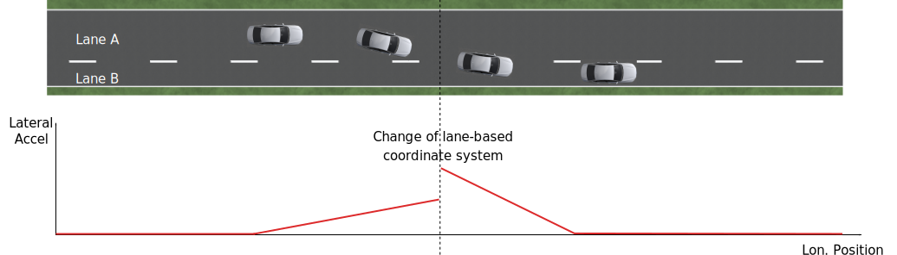
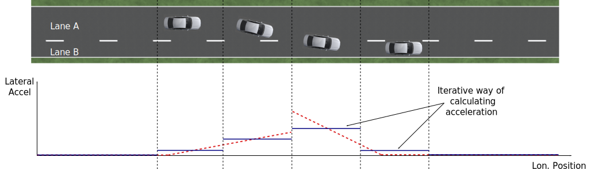

# ad-rss-lib Realization

## RSS checks and response
To check whether the ego vehicle is in a safe state, all the objects in the
surrounding must be respected. To do so the ad-rss-lib will perform an analysis
against all the objects in the environment individually. Meaning, for each
object in the environment the ad-rss-lib will check whether the ego vehicle
conflicts with this object. Therefore, longitudinal and lateral checks are
performed. As mentioned earlier, these checks are performed separately for each
object - ego vehicle pair, i.e. for each situation.

At this, the type of situation has to be evaluated upfront outside
of this library implementation. Otherwise, this RSS implementation
would enforce a concrete representation of the environment and i.e.
the map data with lanes, intersections and priority rules.
The situations types that have to be identified are:

1. both vehicles drive on the same road

  - in the same direction
  - in opposite direction

2. both vehicles drive on different roads that are connected by an intersection

   - the ego vehicle has priority over the other vehicle
   - the other vehicle has priority over the ego vehicle
   - both vehicles have same priority (no vehicle has priority over
     the other vehicle)

### Longitudinal conflicts
The behavior for longitudinal conflicts (checks and response) for vehicles
driving in the same direction are implemented as described in the definitions 1,
3 and 4 of the [RSS paper](https://arxiv.org/abs/1708.06374). For the case of vehicles driving
in opposite directions, the implementation follows the definitions 2, 3 and 4 of
the paper.

In detail, the current realization looks as follows:

#### Same direction

If the longitudinal distance is not safe and

1. if the ego vehicle is in front, the other vehicle
   has to break longitudinally. There is
   no longitudinal response for the ego vehicle issued.
2. otherwise, the ego vehicle has to break longitudinally with at
   least $\alpha_{min,brake}$.

#### Opposite direction

If the longitudinal distance is not safe and

1. if the ego vehicle is driving in the correct direction,
   the ego vehicle has to break longitudinally with at
   least $\alpha_{min,brake,correct}$.
2. otherwise, the ego vehicle has to break longitudinally with at
   least $\alpha_{min,brake}$.

### Lateral conflicts
The lateral checks and the proper response follow the definitions 5, 6, 7 and 8
of the [RSS paper](https://arxiv.org/abs/1708.06374).

In detail, the current realization looks as follows:
If the lateral distance is not safe and

1. if the ego vehicle is on the left side, the ego vehicle has to break
   laterally with at least $\alpha^{lat}_{brake,min}$ on the right side
2. if the ego vehicle is on the right side, the ego vehicle has to break
   laterally with at least $\alpha^{lat}_{brake,min}$ on the left side
3. otherwise, the ego vehicle has to break
   laterally with at least $\alpha^{lat}_{brake,min}$ on both sides

### Combining longitudinal and lateral response
The combination of longitudinal and lateral response of a single situation
(object - ego vehicle pair) is implemented as described in definitions
9 and 10 of the [RSS paper](https://arxiv.org/abs/1708.06374).

In detail, the current realization looks as follows:

If the situation is dangerous (i.e. there exists
a longitudinal and a lateral conflict), the stored
last non-dangerous state of the of the same situation (ego-vehicle - object pair)
is checked:

1. if there was no lateral conflict, the combined response breaks laterally
2. if there was no longitudinal conflict, the combined response breaks longitudinally

### Combining all situations of a given point in time
Since this RSS implementation performs the above mentioned check separately for
each situation, the overall response of the ego vehicle has to consider
all individual situations of the current scene.

The current realization loops over all situations and combines the lateral left,
the lateral right and the longitudinal response states of these by selecting
the most severe response of each component respectively.

### Evasive maneuvers
!!! IMPORTANT
    This initial implementation does not yet cover evasive maneuvers to
    compensate for improper behavior of others according to definitions 11, 12
    and 13 of the [RSS paper](https://arxiv.org/abs/1708.06374).

If the car finds itself in a dangerous situation one possible action is always
to brake. This should always result in a safe state, if both vehicles respond
properly according to RSS. Improper behavior of others might still lead to an
accident. This is where evasive maneuver could prevent from this.
To do so, it must be assured that this lateral movement brings the vehicle
into a safe state and does not conflict with another vehicle.
In order to determine whether a lateral movement solves the conflict a
prediction of the state would be necessary.

Such a naive predication following definition 11 of the paper is not
available yet in this initial implementation. In addition, the ad-rss-lib
currently has no notion of drivable freespace area.
Hence, it cannot determine that an evasive maneuver initiated by RSS will cause
an accident with an obstacle or forces the vehicle to leave the road.

Therefore, it is impossible for the ad-rss-lib in its current form to detect
whether a lateral evasion is really feasible. Hence, _the ad-rss-lib will not
initiate a lateral evasive maneuver_ according to definitions 12 and 13
of the paper. Instead, it will only restrict the movement in the
dangerous direction.

Please note that this restriction does not hinder the driving policy to find a
better escape for the current situation. If this is the case, for example by
braking harder, or changing lanes quicker, RSS will not forbid this maneuver,
as long as it does not create another conflict, and is compliant with the
restrictions calculated by RSS.

### Handling of Intersections
The behavior for intersection conflicts (checks and response) for vehicles is
implemented as described in the definitions 16, 17 and 18 of the [RSS paper](https://arxiv.org/abs/1708.06374)

In detail, the current realization looks as follows:

1. It is checked, if a non-prioritized vehicle _was_ able to stop in front of
   the intersection. If this is the case, the non-prioritized vehicle is
   supposed to brake, whereas the prioritized vehicle can continue driving as
   before.
2. If 1. does not hold, it is checked, if there is a safe longitudinal distance
   between the two vehicles according to Definition 17.2 of the [RSS paper](https://arxiv.org/abs/1708.06374). In this
   case, the leading vehicle can continue driving, whereas the following
   vehicle has to respect the "stated braking pattern".
3. If 1. and 2. do not hold, there is a time period in which both vehicles may
   be crossing the intersection. In this case Definition 18.3 of the [RSS paper](https://arxiv.org/abs/1708.06374)
   applies, i.e. both cars have to brake laterally and longitudinally with at
   least $\alpha_{min,brake}$.

!!! NOTE
    Case 1. is the direct realization of Definition 17.1, where it is mentioned
    that the vehicle _was_ able to stop safely. However, as a consequence, the
    prioritized vehicle is not forced to brake, if the non-prioritized vehicle
    does not respect RSS. Since the evasive maneuvers are not yet implemented
    such kind of improper behavior cannot be handled by the current ad-rss-lib.

!!! IMPORTANT
    In the current realization of the ad-rss-lib, it is assumed that there is
    always a lateral conflict in case of intersections. This will be addressed
    in future.

### Response Time and Other Parameters
According to the papers each traffic participant has a response time, and is
objected to respect certain acceleration limits (e.g. maximum acceleration
$\alpha_{accel,max}$, maximum deceleration $\alpha_{brake,max}$, etc.). Within
this response time the participants (including the ego vehicle) are allowed to
accelerate with at most $\alpha_{accel,max}$, and thus increase their velocity.
The distance covered during the response time is part of the safe distance, as
defined by RSS. Hence, upon entering a dangerous situation, it would be
possible to accelerate with up to $\alpha_{accel,max}$ for at most t < response
time, as this acceleration is already considered.

!!! NOTE
    It is important to note that the implementation of the ad-rss-lib in the
    library only uses parameters, but not the exact value. By this means, the
    library is independent to changes of the parameter values. Instead, the user
    defines a feasible parameter set, which is provided as input to the
    ad-rss-lib.

A discussion on the parameter selection can be found in the [parameter discussion section](./Appendix-ParameterDiscussion.md#parameter-discussion).

## Situation-Based Coordinate System
As described in the [RSS paper](https://arxiv.org/abs/1708.06374) in section 3.2 "Preliminaries — A Lane-Based Coordinate
System", all RSS calculations are
based on a lane-centric coordinate system. This system uses adjacent, straight
lanes of constant width, and thus requires a transformation of the object
states from Cartesian into the lane space. This transformation into a
lane-based coordinate system is described by a bijective function, as pointed
out by paper 1. Therein, the lateral position of a vehicle within the lane is
mapped to a parametric interval [_-0.5; 0.5_], where the lane boundaries are
fixed at the borders of the interval. The advantage of such a coordinate system
over the Cartesian system is that it allows the direct calculation of
longitudinal and lateral distances of objects.

However, when transforming the Cartesian space into a lane-based coordinate
system, several challenges have to be taken into consideration.

### Comparing movements in lane-based coordinate systems
During the transformation process to a lane-based coordinate system, not only
the position but also the the velocities and accelerations have to be
transformed. As a matter of fact, the resulting values depend on the actual
lane geometry, and thus, velocities and accelerations of different lane-based
coordinate systems cannot be compared to each other anymore (ego vehicle - object pair). To illustrate this
problems, let us consider the following examples:

#### Discontinuity Problem: Two parallel lanes, different width

|  |
|:--:|
| *Figure 1: Two parallel lanes with different width causing a discontinuity in lateral acceleration* |

Let us illustrate this on a simple example with two parallel lanes of different
width. Let the left lane A have a constant width of _4 m_ where the right lane
B only has a constant width of _2 m_. If both lanes define their own lane-based
coordinate system $LCS_A$ and $LCS_B$, a Cartesian lateral acceleration value
of _1 m/$s^2$_ becomes _0.25 lat/$s^2$_ in $LCS_A$ and _0.5 lat/$s^2$_ in
$LCS_B$. Therefore, the formula for constant accelerated movement has to use
different acceleration constants in different lanes. This situation is getting
even worse, if a car is changing the lane from lane A to lane B: then the
closed formula for constant accelerated movement to calculate the lateral
distance over time cannot be applied anymore directly.

#### Changing Acceleration Problem: Lane is widening/narrowing

|  |
|:--:|
| *Figure 2: Changing lane width and its impact on the lateral acceleration* |

Let us consider a lane with changing width in another example. If the lane's
width at the beginning is _4 m_ and _100 m_ away the lane is narrowing to _2 m_.
In such a case the Cartesian lateral acceleration value of _1 m/$s^2$_ is
changing from _0.25 lat/$s^2$_ at the beginning towards _0.5 lat/$s^2$_ while
advancing within the lane.

#### Changing Distances Problem: Lane with a narrow curve

|  |
|:--:|
| *Figure 3: Lane describing a narrow 180° curve and its impact on driven distances* |

This section illustrates a longitudinal situation similar to the lane widening
example. Let us assume the lane has a constant width of _4 m_ describing a
curve with inner radius of _50 m_ covering _180°_. The inner border of the lane
has a length of about _157.1 m_, the center line _163.4 m_ the outer border
_169.7 m_. In that situation a longitudinal acceleration value will evaluate
to _1.0 lon/$s^2$_ for the center line, _0.96 lon/$s^2$_ for the outer border and
_1.04 lon/$s^2$_ for the inner border. Therefore, the longitudinal acceleration
changes over time, if the vehicle changes its lateral position within the lane.

#### Summary
As sketched in the previous sections both the longitudinal as well as the
lateral acceleration values, as well as velocities within the lane-based
coordinate system cannot be considered as constant anymore. Moreover, these
values do not only change within one coordinate system, but also when changing
from one lane-based system to another one. To overcome this issue, we use a
_"Situation-Based Coordinate System"_, that is described in detail in the next
section. This system is unique for each situation (ego vehicle - object pair)
and comprises _all_ lanes required to describe this situation.

#### Chosen Design: Individual Situation-Based Coordinate System
As RSS performs a worst case assessment, the idea followed by the ad-rss-lib
implementation is to calculate the min/max position values of the vehicles
within the situation specific coordinate system. According to the constellation of the
vehicles within the situation, the respective worst case lateral and longitudinal
border values are selected and processed by the RSS formulas.
Like this, it is assured that the calculations are sound, nevertheless this
might lead to a more cautious behavior of the vehicle.
The following subsections describe the selected approach in more detail.

#### Two parallel lanes, different width
As described in the previous section, the border between neighboring lanes
of different width introduces discontinuities of the lateral acceleration values
(see Figure 1).

As the ad-rss-lib judges the relative situation between the ego vehicle
and the other objects one by one individually, it is not required to distinguish
between the actual lanes within the individual distance calculations.
Combining all lanes relevant for the individual situation $s_i$
between ego vehicle and object $o_i$ into one single situation-based
coordinate system $SCS_i$ resolves all discontinuities, as depicted in Figure 4.

|  |
|:--:|
| *Figure 4: Avoid discontinuities by using one single situation-based coordinate system* |

Coming back to the concrete example from Figure 1,
left lane A having a constant width of _4 m_ and right lane B having a constant
width of _2 m_, both lanes together have a resulting width of _6 m_ and form
an area with continuous lateral acceleration (see also
illustration in Figure 4).

The check of the ego vehicle with another object $o_j$ which is two lanes at the
right of the ego vehicle in a lane C having a constant width of _3 m_, has to
take all three lanes into account with resulting width of _9 m_. Therefore, a
different situation-based coordinate system $SCS_j$ is required, when checking
another object.

#### Lane is widening or has a narrow curve
The individual situation specific coordinate system $SCS$ does not yet cover
the situations of widening lanes or narrow curves. To take the variation of the
lane width and length into account, it is required to apply the extrema
within the respective $SCS$ accordingly.

Again, coming back to the examples from above, let us have a lane with non
constant width between _2 m_ and _4 m_. Then the transformation of the maximal
possible lateral position value of the vehicle into the situation coordinate system
$SCS$ has to take the maximum width of _4 m_ into account,
while the transformation of the minimal possible lateral position has to
be transformed with the minimum width of the lane of _2 m_.
Like this it is guaranteed that we don't underestimate the distances of the vehicles
towards each other. As a result, it is ensured that under all conditions, the safety
distances are calculated in a conservative manner.

In a similar way, it is possible to transform the longitudinal position
values into the situation-based coordinate system $SCS_k$.

!!! Note
    The performed operations can be interpreted as enlarging the vehicles
    bounding boxes to ensure the worst case is covered.

#### Road area
To overcome the problems of discontinuities, changing lateral and
longitudinal distances resulting in not comparable velocities and accelerations
the situation based coordinate system merges in a first step all lanes segments
relevant to the situation (ego vehicle - object pair) into one situation
specific metric road area. One can imagine this step as the creation
of a bounding box around the two vehicles
that is large enough to cover the relevant positions of those
while ignoring actual markings on the road between the lanes.
By this, especially the physical lateral velocities and accelerations within the
Cartesian 2D space of the road area can be measured and calculated straight
forward without any discontinuities (see also the illustrations in
Figure 5 and Figure 6).

|  |
|:--:|
| *Figure 5: Creation of the situation-based coordinate system: The road area (red) consists of all lane segments along the road relevant for the situation between the two vehicles* |

|  |
|:--:|
| *Figure 6: Creation of the situation-based coordinate system: Worst-case transformation of the vehicle bounding box. The metric road on the left leads to transformed vehicles and their bounding boxes (red) on the right, sketched for a narrowing road area at the top and a curve at the bottom.* |

It is worth to mention, that in these calculations the actual
shape of the lane is not used. Therefore,
detailed knowledge of the actual lane geometry is not
required. The absolute maximum and minimum width and length values of the lane
segments is sufficient to calculate a proper transformation into the space of
the situation specific coordinate systems.

!!! NOTE
    In case of intersections both vehicles define their own road areas including the
    intersecting parts. The case that a lane is ending or two lanes are
    merged into one single lane have to be treated like intersections since
    a lateral conflict is unavoidable.

#### Considerations on reverse transformation of the proper response
As the proper response is referring to the situation-based coordinate
systems, the response has to be transformed back considering the actual
lane geometry. Therefore, first the transformation into the
vehicle-specific lane-based coordinate system is required,
and then the transformation into the Cartesian space is performed.

A simple example illustrates this: a vehicle driving in a curve will for sure
have to perform a lateral acceleration in Cartesian space otherwise it will
leave the lane because of the centripetal force, as illustrated in
Figure 7. However, in the vehicle specific
lane-based system the lateral acceleration will be 0.

|  |
|:--:|
| *Figure 7: Constant drive around a curve will result in a zero lateral acceleration in a lane-based coordinate system and in a non-zero acceleration in a cartesian system* |

Because the proper response of RSS is defined with respect to the actual lane
the vehicle is driving in, it is required to assure that the reverse
transformation of the proper response considers only the ego-lane and not the
complete situation specific coordinate systems. For example, let us consider a
scenario as depicted in Figure 8,
where one widening lane A and one narrowing lane B are neighbors in such a way
that the overall width of the road is constantly _6 m_. Lane A starts with _2 m_
and ends with _4 m_ width, whereas lane B starts with _4 m_ and ends with _2 m_
width. A lateral velocity of 0 in respect to the whole road differs from the
definition of a lateral velocity of 0 in lane A/lane B in Cartesian space.

|  |
|:--:|
| *Figure 8: Different lateral accelerations in a lane-based system and Cartesian system for a vehicle following the centerline of lane B* |

!!! NOTE
    It is worth to note that in the particular implementation of the ad-rss-lib in
    the library at hand, the reverse transformation from the situation-specific
    into a vehicle-centric lane coordinate system is not required, as the RSS
    response is defined such that it is independent of these two coordinate system.

#### Summary
The presented construction of a continuous situation-based coordinates system
will allow the pairwise calculation of the safe distances between ego vehicle
and objects with the assumption of constant acceleration. Still, the worst case
assessment of RSS is not violated. This situation-based coordinate system in
conjunction with the situation specific consideration of the position extrema
allows the calculation of the safe distances, the decision on
dangerous situations and deduction of a proper response.

The main benefits of the selected Situation Based Coordinate System definition are:
*	Velocity and acceleration values in longitudinal and lateral lane directions
  do not change when transforming into the situation based coordinate system
*	All formulas for constant accelerated movement can be applied in the
  situation based coordinate space.
* Distance calculations in situation based coordinate systems are
  simple additions or subtractions
* The transformation into the situation based coordinate system is simple and
  therefore can be implemented easily with the restricted computational
  resources of safety controllers

For safety considerations, it is crucial to do all calculations considering the
worst case assumption. Therefore, it is required to choose the correct
minimum or maximum value of the positions in the situation-based coordinate
system to assure that always the worst case is considered.

### Design alternative: Iterative Approach [optional]

|  |
|:--:|
| *Figure 9: Illustration of an iterative approach to calculate non-constant acceleration, velocity etc.* |

Another possible way to handle the non-constant acceleration values would be an
iterative approach: based on the position, the velocity and the acceleration
values at the given position at time $t_0$, the position at time $t_1$ is
calculated. The smaller the time interval between the iteration steps is
chosen, the smaller the calculation error gets (see figure above).

One drawback of the iterative approach is that the RSS implementation has to get
to know the lane geometries in detail to be able to calculate the acceleration
values to be used for every position within the situation-based coordinate
systems. Therefore, this design approach is not selected by this ad-rss-lib
implementation.

## Summary

!!! Summary
    * RSS checks are performed on the current state on a ego vehicle - object pair
      basis
    * In dangerous situations only braking maneuvers are issued. RSS does not
      initiate evasive maneuvers, but will not hinder the driving policy
      to execute lateral evasive maneuvers, as long as these are compliant with
      the required RSS response.
    * To handle changing lateral/longitudinal lane geometries when
      transforming the Cartesian space into the situation based coordinate system,
      the vehicles position extrema are chosen in such a way that accelerations
      can still be treated as constant, but guarantee safe operation (see
      <<Section::SituationBasedCS::ChosenDesign>>).
