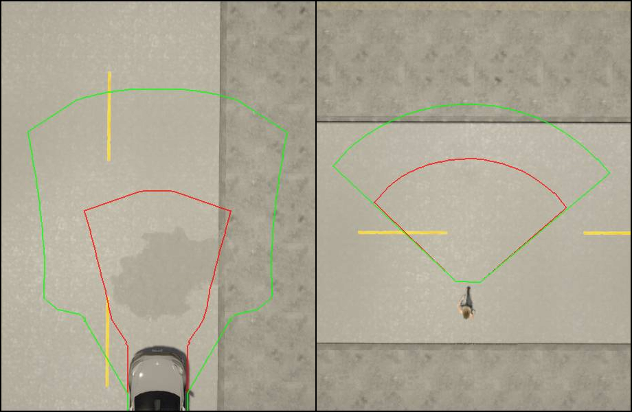
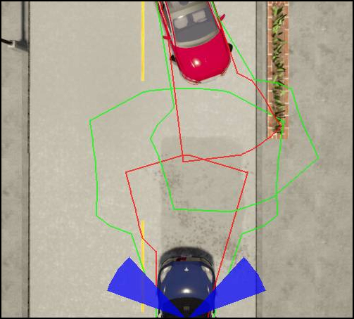

## Overview

Unstructured constellations implement unstructured roads (described in chapter 3.7.2 of the [RSS paper](https://arxiv.org/abs/1708.06374), definitions 19-22) and pedestrians (described in chapter 3.8).
In contrast to the structured constellations, two dimensional trajectories with lateral and longitudinal component are calculated.

### World Modeling

To allow customization, every constellations within the [`ad::rss::world::WorldModel`](https://intel.github.io/ad-rss-lib/doxygen/ad_rss/structad_1_1rss_1_1world_1_1WorldModel.html) can be calculated as unstructured, depending on the `situationType`.

### Behavior Model/Trajectory Set Calculation

To calculate a trajectory set, the maximum/minimum values for both, longitudinal and lateral component are applied.

The longitudinal boundaries of a trajectory set are defined by the minimum/maximum accelerations, the lateral by the maximum heading change to the left and right.

| Side | Longitudinal | Lateral |
|------|--------------|---------|
|Front | max acceleration | max left .. max right |  
|Back  | max braking | max left .. max right |  
|Left  | max braking .. max acceleration | max left |
|Right | max braking .. max acceleration | max right |

Each combination is used to calculate a final trajectory point (i.e. a position and a heading). Ranges are sampled.

Afterwards the vehicle dimensions are applied and a border polygon is calculated which defines the trajectory set.

!!! IMPORTANT
    The current implementation uses simplifications that might not calculate valid trajectory sets for certain parameters.

There are two relevant trajectory sets: for braking $T(C_{b})$ and continue-forward $T(C_{f})$. The difference is the longitudinal acceleration after response time:

|   | $\alpha_{\rho,min}$ | $\alpha_{\rho,max}$ |
|------|--------------|---------|
| $T(C_{b})$     | $\alpha_{brake,max}$ | $\alpha_{brake,min}$ |
| $T(C_{f})$     | $\alpha_{brake,max}$ | $\alpha_{accel,max}$ |

This is similar for all traffic participants and uses the same rss formulas as in the structured case.

The lateral change is depending on the type of traffic participant, as described below.

|  |
|:--:|
| *Example trajectory sets for car and pedestrian (red: brake-, green: continue-forward-trajectory)* |

There are two different behavior models, for vehicles and pedestrians.

#### Vehicle

* The change of the yaw rate $h'(t)$ is limited: The maximum change of the yaw rate until response time can be specified by `UnstructuredSettings::vehicleYawRateChange`.
* The radius of the circle, the vehicle is driving on is $r(t) = v(t)/h'(t)$
* At emergency, after the response time, the vehicle continues driving on a circle (i.e. no further yaw rate change)
* The minimum radius `UnstructuredSettings::vehicleMinRadius` defines the minimal radius a vehicle is able to drive on

The calculation is done in three steps.

1. Calculate the possible vehicle states and locations at response time
2. Calculate the final vehicle state and location for brake and continueForward
3. Create the corresponding trajectory set polygons

In the first step, the vehicle state at response time is calculated by using time increments, specified by `UnstructuredSettings::vehicleTrajectoryCalculationStep`. (This might lead to an increasing error the farer the point is). The amount of states can be customized by several parameters:

- `UnstructuredSettings::vehicleBackIntermediateYawRateChangeRatioSteps` specifies how many steps beside maximum yaw rate change to the left/right and no change at all should be calculated. The value is specifying the steps on one side, therefore the resulting intermediate steps are twice this value. This value is used for the back of the trajectory set.
- `UnstructuredSettings::vehicleFrontIntermediateYawRateChangeRatioSteps` similar to above, but for the front of the trajectory set.

In the second step, the final vehicle state is calculated for each of the response-time vehicle states by using the corresponding acceleration driven on a circle. The following parameters can be specified:

- `UnstructuredSettings::vehicleContinueForwardIntermediateAccelerationSteps` specifies the intermediate acceleration steps (between brakeMin and accelMax) used while calculating the continue forward trajectory set.
- `UnstructuredSettings::vehicleBrakeIntermediateAccelerationSteps` specifies the intermediate acceleration steps (between brakeMax and brakeMin) used while calculating the brake trajectory set.
- `UnstructuredSettings::vehicleContinueForwardIntermediateYawRateChangeRatioSteps` specifies the intermediate yaw rate change ratio steps used while calculating the continue forward trajectory set.

In the third step the final trajectory sets are calculated. To reach an acceptable calculation time some simplification are applied. Keep in mind, that this might cause invalid responses! For each value of acceleration a final state is calculated. This contains of at least three vehicles states: two with maximum yaw rate change to left and right and one with no yaw rate change. For the back and front of the trajectory set there might also be intermediate values for the yaw rate change. For the front a convex hull of all states (including vehicle dimensions) is calculated. For the ones defining the sides of the trajectory set (where only max left/right and center vehicle state are available) a polygon is calculated by merging the convex hull of left+center and right+center. To create the trajectory set all polygons are merged together, including polygons for the linear estimation between the steps.

#### Pedestrian

* The change of heading $|h'(t)|$ is limited. That means, the maximum trajectory is defined by a circle until response time. The radius of this circle can be specified by `UnstructuredSettings::pedestrianTurningRadius`.
* At emergency, after the response time, the pedestrian will continue at a straight line
* If the pedestrian is standing, we assign it to all possible lines originating from his current position.

Similar to the vehicle calculations the following settings can be used to improve the precision of the polygons:

* `UnstructuredSettings::pedestrianContinueForwardIntermediateHeadingChangeRatioSteps` specifies the intermediate heading change ratio steps used while calculating the continue forward trajectory set.
* `UnstructuredSettings::pedestrianContinueForwardIntermediateAccelerationSteps` specifies the intermediate steps used while calculating the continue forward trajectory set. (As the pedestrian at max moves on a circle, this value specifies how many points on the circle arc are used)
* `UnstructuredSettings::pedestrianBrakeIntermediateAccelerationSteps` specifies the intermediate steps used while calculating the brake trajectory set. 
* `UnstructuredSettings::pedestrianFrontIntermediateHeadingChangeRatioSteps` specifies the intermediate steps that are used. The value is specifying the steps on one side, therefore the resulting intermediate steps are twice this value. This value is used for the front of the trajectory set.
* `UnstructuredSettings::pedestrianBackIntermediateHeadingChangeRatioSteps` specifies the intermediate steps that are used. The value is specifying the steps on one side, therefore the resulting intermediate steps are twice this value. This value is used for the front of the trajectory set.

### Decision making

The [RSS paper](https://arxiv.org/abs/1708.06374) definition 22 states conditions, that are relevant to calculate if a constellation is dangerous and how to behave then.

Depending on their values, three decisions are possible:

* _brake_: Longitudinal braking
* _continue forward_: Continue driving without limitations
* _drive away_: Drive away within a certain heading range

The conditions are based on the brake and continue-forward trajectory sets for the ego vehicle and another traffic participant.

Condition 22.1

a.) $T_{ego, brake} \cap T_{other, forward} = 0$ and $T_{other, brake} \cap T_{ego, forward} \ne 0$

b.) $T_{other, brake} \cap T_{ego, forward} = 0$ and $T_{ego, brake} \cap T_{other, forward} \ne 0$

Condition 22.2

$T_{ego, brake} \cap T_{other, brake} = 0$

The following diagram describes the decision making.

|  |
|:--:|
| *Decision making* |

The condition 22.1.b at the last safe point in time might lead to the behavior "Continue Forward" although the constellation is dangerous. The reason is, that the conditions 22.1 define, which traffic participant has to brake and which one can continue.

### Response

#### Continue Forward

If the result is _continue_forward_ no acceleration restrictions are applied.

#### Brake

If the result is _brake_, the longitudinal acceleration restriction is set to `alphaLon.brakeMin` of the state.

#### Driving away

In certain situations the ego vehicle might be allowed to drive away from a dangerous constellation using a given heading range.

The heading range is calculated using the position vectors of the traffic participants and the velocity vector of the ego.

The angle between $\tau_{ego}(t) − \tau_{other}(t)$  and $\tau'_{ego}(t)$ needs to be $\le \theta$

$\theta$ can be specified by `UnstructuredSettings::driveAwayMaxAngle`

As multiple constellations might allow different ranges to drive away, the [`ad::rss::state::ProperResponse`](https://intel.github.io/ad-rss-lib/doxygen/ad_rss/structad_1_1rss_1_1state_1_1ProperResponse.html) provides a vector of `headingRanges`. Together with the steering range of the vehicle the allowed heading range can be calculated.

|  |
|:--:|
| *Allowed heading ranges in blue* |

If multiple states result in _drive_away_, but no headingRange overlap is available the state is escalated to _brake_.

The _drive_away_ mode remains active as long as:

1. The ego vehicle moves with a steering angle that is within the allowed heading range
2. The other vehicle doesn't move

