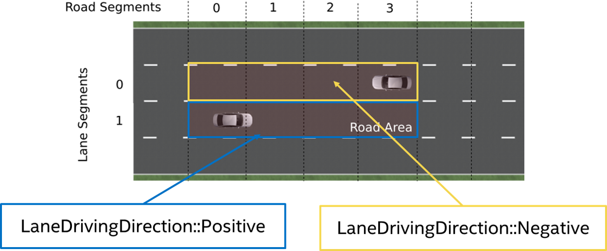

# Construction of the RSS Scenes between two vehicles 

The RSS core implementation (*ad_rss*) proposes a situation based coordinate system to
perform the RSS calculations between two vehicles. This library provides an exemplary
implementation on how a real-world situation can be transformed into such
coordinate system.

!!! NOTE
    This implementation considers neither all possible road network layouts nor all
    configurations between two vehicles that may happen. In reality, many corner-cases have to be
    considered to cover all of that (e.g. a backward driving car).

#### Table of contents
1. [Construct situations](#constructsituations)
2. [Construct Road Area](#constructroadarea)
3. [Convert Vehicle Data](#convertvehicledata)
4. [Consider Speed Limits](#considerspeedlimits)

### Construction of the individual situations 
In general, the real world road network is far more complex than just one straight road:
the situation between two vehicles is not necessarily unambiguous, especially
as the vehicles can take different routes through intersections. Therefore, the
worst-case has to be covered here, too. All potential configurations have to be
considered when performing the situation analysis and creating the respective
Situation Based Coordinate System. As a result of this there might be multiple
situations at the same time to be considered between two vehicles.

Before the actual road area of the vehicles can be calculated, the type of situation
has to be determined, which is performed within ad::rss::map::RssSceneCreation::appendScenes() as follows:

#### Calculate the connecting route
Based on road network data, the vehicle position and the object position, the shortest connecting route
between these two is calculated (ad::map::route::planning::calculateConnectingRoute()).
To cover also opposite direction and intersection use-cases, the nominal driving direction
on the lanes is disregarded when the connecting route is calculated.
Furthermore, as the map matched positions of vehicle and object might span over multiple
lanes, all possible combinations are taken into account.

#### Decide on the kind of situation: same direction, opposite direction or intersection

1. If both vehicles are driving in the same direction with respect to the connecting route
a same direction situation is created. This is done, regardless if there are intersections
between the two vehicles present, because one vehicle just follows the other, potentially through the intersection.
|  |
| -- |
| *One vehicle is following the other on the same road by driving in the same direction: either on the same lane or on another parallel lane* |

2. If both vehicles drive in opposite direction and there is no intersection in between an opposite direction situation is created.
|  |
| -- |
| *Both vehicle are approaching each other on the same road by driving in the opposite direction: either on the same lane or on another parallel lane* |

3. Otherwise, the potential future routes of the vehicles have
to be calculated and combined with each other. As in an AD vehicle the ego route usually is known
that route is taken as basis for the ego vehicle, if present. Every intersection present in both
routes of these combinations might result in a new situation to be considered:
|  |
| -- |
| *Besides classical X-intersection or T-intersections also areas where lanes vanish and a lateral conflict is unavoidable have to be treated as intersection cases.* |

  * If both drive through the intersection coming from different intersection arms without crossing routes,
    the vehicles pass each other and an opposite direction situation is created
  * Else, the routes within the intersection are crossing each other and an intersection situation is created.
    To decide which of the vehicles has priority within the intersection the capabilities of the class
    ad::map::intersection::Intersection() are used. In case of traffic light intersections, the kind
    and status of the relevant traffic light determines the current priorities.

#### Handling of similar situations
The consideration of intersections with all the possible routes leads to an increase in the number
of situations. Therefore, to reduce the computational effort of the actual safety analysis,
within the *ad_rss* core implementation situations that represent the same scene are merged
if they describe the 'same' situation (i.e. the same route through the intersection).
To achieve this, and still be able to keep the worst case assessment, the distances to enter/leave the
intersection both are intervals to provide the minimum and maximum observed distance to enter and leave
the respective intersection.

|  |
| -- |
| *Steps to create the situations required for safety calculations having the road network as well as the object data available as input* |

### Construction of the situation specific Road Area 
RSS incorporates the changes in the road geometries as minimum/maximum length and width
parameters of the respective lane segments into the worst-case consideration of positions and distances.
This makes the vehicle behaving over cautious if the road sections taken into account
are selected unnecessarily large: the more the differences in minimal/maximal width
or length of these segments are the more conservative the behavior of the vehicle gets.
Therefore, the road area for the creation of the situation is restricted to the direct
surrounding of the two vehicles, which is represented by the connecting route as
described in the last section for non-intersection situation.

|  |
| -- |
| *Construction of a same direction Road Area as basis for the Situation-Based Coordinate System: The red area consists of all lane segments along the road relevant for the situation between the two vehicles* |

Nevertheless, the nominal driving direction of the lane segments in respect to the direction
of the road area have to be preserved to allow RSS to decide if a vehicle is driving in wrong direction. The direction of the road area is determined by the driving direction of the vehicles.

|  |
| -- |
| *In opposite direction use-case, where both vehicles are approaching each other, the direction is determined by the driving direction of the ego-vehicle* |

In intersection situations, both vehicles approach from different roads. Therefore, two road areas have to be taken into account which end in an overlapping area at the intersection.

|  |
| -- |
| *Construction of the situation specific Road Area in case of an intersection: Each vehicle gets its own road area. The lane segments within the intersection are marked as such. Be aware: The lane segment type intersection is only provided for lane segments of the intersection under consideration within the current situation.* |

### Conversion of the vehicle data in respect to the Road Area  
Having the situations and the respective Road Area(s) constructed, the vehicle data has to be
converted into the desired RSS object format ad::rss::world::Object. The main aspects of this
are the conversion of the velocity and of the bounding box.

#### Conversion of the vehicle velocity within the road area
|  |
| -- |
| *Example road area for velocity conversion* |

To convert the velocity of a vehicle within the situation, one can take the center point of the vehicle and the vehicle orientation in respect to the road area driving direction
as basis to split the vehicle speed into its lateral and longitudinal components in respect to the borders of the road area.

Having a detailed look at the left vehicle within the above sketched scene. Let it drive with 10m/s
in parallel to the lanes. The split of the velocity leads to longitudinal velocity component of $v_{lon} = 10 m/s$ and a lateral velocity component of $v_{lat} = 0 m/s$.

|  |
| -- |
| *Vehicle velocity conversion on straight lanes* |

This becomes different, when the lane is not straight anymore. When driving with $20\circ$ in
respect to the lane at the center point. For the center point one gets a longitudinal velocity component of $v_{lon} = \cos(20\circ) * 10 m/s = 9.4 m/s$ and a lateral velocity component
of $v_{lat} = \sin(20\circ) * 10 m/s = 3.4 m/s$.

|  |
| -- |
| *Vehicle velocity conversion in curves* |

#### Construction of the situation based bounding box of the vehicles within the road area
Based on the Road Area, the individual bounding box of the vehicles are calculated.

|  |
| -- |
| *Road Area with lane Ids assigned* |

For this, the ad::map::match::LaneOccupiedRegionList with the occupied regions calculated on basis of
the real lane geometries (see *ad_map_access* for reference) is transformed into the
ad::rss:world::OccupiedRegionVector mainly by:

* consider only lanes present in the Road Area
* adapt the parametric range in respect to the driving direction of the lane segment
  within the Road Area

|  |
| -- |
| *Example occupied regions for two vehicles within a Road Area* |

On the one hand side this step is simple in calculation, but because of the representation of the lane segments within the Situation-Based Coordinate System (minimal/maximal width and length)
and the use of the situation specific worst-case lateral and longitudinal border values of the
vehicles within the RSS calculations, the vehicle bounding boxes are enlarged finally as depicted in
the following image:

|  |
| -- |
| *Creation of the situation-based coordinate system: Worst-case transformation of the vehicle bounding box. The metric road on the left leads to transformed vehicles and their bounding boxes (red) on the right, sketched for a narrowing road area at the top and a curve at the bottom.* |

#### Calculation of Metric distances within the Road Area
The minimal (maximal) metric position $p^{lon}_{min}$ ($p^{lon}_{max}$) in longitudinal direction of a vehicle within the road area
is calculated by taking the sum of all minimal (maximal) metric lengths of all previous road segments,
plus the parametric scaled minimal (maximal) length of the first road segment it touches (explained in detail in the subsections below).
Like this, the $\Delta$ of every part of the road segment up to the vehicle is finally incorporated into it's
metric length within the road area $l = p^{lon}_{max} - p^{lon}_{min}$: The vehicle gets stretched by each of the $\Delta$.

To calculate the longitudinal distance of two vehicles towards each other the maximum position of the vehicle at the back is
subtracted from the minimum position of the vehicle in front: $d^{lon} = p^{lon}_{front,min} - p^{lon}_{back,max}$
This happens in a similar way in lateral direction and with the distance towards the intersection.
Because the *ad_rss* implementation takes all parts of the road area into account as
provided from outside (i.e. does *not* cut-off the road area before the first car),
the $\Delta$ is incorporated as negative component into $d^{lon}$.
The following Figure provides an example:

|  |
| -- |
| *Example: Let the actual distance of the two cars be $d^{lon}_{real} = 17\,m$.
   Further let the right border of the road area curve within the intersection be 15\,m and the outer border be 23\,m.
   With the transformation into *ad_rss* situation based coordinate system the information on the actual road geometry gets lost, so that the
   difference of the border length of 6\,m in a road segment at the beginning leads to a decreased metric distance
   of the two cars of $d^{lon}_{RoadArea} = 11\,m$.
   Cutting the road area after the (red) vehicle in the back would lead to $d^{lon}_{RoadArea} = d^{lon}_{real} = 17\,m$.* |

To understand the details of why it is important to restrict the road area in its extend,
the actual realized calculation of metric bounding box and metric distances within the road area within *ad_rss* are sketched in the following sections.

##### Metrics of road segments within Road Area
The overall metric minima/maxima of the road segment at index r ($RS_{min}^r, RS_{max}^r$) is calculated by combination of the minima/maxima ($LS_{min},LS_{max}$) of the contained lane segments:

$RS_{lon,min}^r = \min\limits_{l}⁡(LS_{lon,min}^{r,l})$

$RS_{lon,max}^r= \max\limits_{l}⁡(LS_{lon,max}^{r,l})$

$RS_{lat,min}^r=0$

$RS_{lat,max}^r= \sum_{l}LS_{lat,max}^{r,l}$ ⁡

The overall minima/maxima dimensions of the road area ($RA_{min}, RA_{max}$) are calculated by the combinations of the minima/maxima of the road segments:

$RA_{lon,min} = \sum_r RS_{lon,min}^r$

$RA_{lon,max} = \sum_r RS_{lon,max}^r$

$RA_{lat,min} = \min\limits_{r}⁡ (RS_{lat,min}^r)=0$

$RA_{lat,max} = \max\limits_{r}⁡ (RS_{lat,max}^r)$

##### Metrics bounding box of vehicles within Road Area
In a similar manner the vehicle parametric bounding box definitions ($PBB$) can be used to calculate
the minimal and maximal metric position in longitudinal direction of the vehicle within of the whole road area: the minimal longitudinal position of a vehicle ($BB_{min}^{lon}$) is calculated by taking the sum of all minimal metric lengths of all previous road segments, plus the parametric scaled minimal length of the first road segment it touches.

$BB_{lon,min} = \sum_{r=0}^{i-1} RS_{lon,min}^r + \min\limits_{l}⁡ ( PBB_{lon,min}^{i,l} * LS_{lon,min}^{i,l} )$ , with i: first road segment the vehicle touches.

$BB_{lon,max} = \sum_{r=0}^{i-1} RS_{lon,max}^r + \max\limits_{l} ( PBB_{lon,max}^{i,l} * LS_{(lon,max}^{i,l})$ , with i: last road segment the vehicle touches.

$BB_{lat,min} = \min\limits_{r}⁡ (\sum_{l=0}^{i-1} LS_{lat,min}^{r,l} + (PBB_{lat,min}^{r,i}* LS_{lat,min}^{r,i}) )$ , with i: first lane segment within road segment r the vehicle touches.

$BB_{lat,max} = \max\limits_{r}⁡ (\sum_{l=0}^{i-1} LS_{lat,max}^{r,l} + (PBB_{lat,max}^{r,i} * LS_{lat,max}^{r,i})$, with i: last lane segment within road segment r the vehicle touches.

##### Metrics distances between vehicles
Having the vehicles metric bounding boxes within the road area at hand, it is straight forward to calculate the current longitudinal and lateral distances of the vehicles towards each other. Let A be the upper left vehicle and B the lower right vehicle in the sketched road area above, then the distances are defined by:

$d_{lon} = BB_{lon,min}^B - BB_{lon,max}^A$

$d_{lat} = BB_{lat,min}^B - BB_{lat,max}^A$

##### Metrics distances in respect to the intersection
The calculation of the intersection distance of a vehicle can then be performed in the following way:

$d_{enter} = \sum_{r=0}^{i-1} RS_{lon,min}^r -BB_{lon,max}$ , with i: first road segment within the intersection.

$d_{exit} = \sum_{r=0}^i RS_{lon,max}^r - BB_{lon,min}$ , with i: last road segment within the intersection.

Having the vehicles metric bounding boxes and the distances to the intersection at hand, it is straight forward to calculate the current longitudinal distance of the vehicles towards each other in respect to the intersection. Let A be the vehicle coming from west and B the vehicle coming from south in the figure above with $d_{enter}^A > d_{enter}^B$, then the distance can be calculated by:

$d_{lon} = \max⁡ (0, d_{enter}^A - d_{enter}^B - (BB_{lon,max}^B -BB_{lon,min}^B))$

### Consider speed limits 
Since the [RSS paper](https://arxiv.org/abs/1708.06374) is assuming worst-case behavior of
other traffic participants, vehicles are allowed to accelerate with maximum possible acceleration
within their reaction time. Especially in urban scenarios this can lead to unnecessarily big safety
distances if expecting that fast driving vehicles are able to accelerate even beyond speed limits.
As it's unreasonable behavior of others to accelerate far beyond the maximum allowed speed,
the construction of the scenes with ad::rss::map::RssSceneCreation::appendScenes() supports
to select between different modes to consider the speed limit within RSS accelerated movement,
by setting the ad::rss::world::RssDynamics dynamics accordingly:

* None: Do not change the objects maxSpeed parameter of the RssDynamics
* ExactSpeedLimit: Set the objects maxSpeed parameter of the RssDynamics to the maximal
  allowed speed of the relevant road section
* IncreasedSpeedLimit5: Set the objects maxSpeed parameter of the RssDynamics to the maximal
  allowed speed of the relevant road section + 5 percent
* IncreasedSpeedLimit10: Set the objects maxSpeed parameter of the RssDynamics to the maximal
  allowed speed of the relevant road section + 10 percent

In general, this extends the scope of the RSS paper, but might be a reasonable change to improve
acceptance within society.
