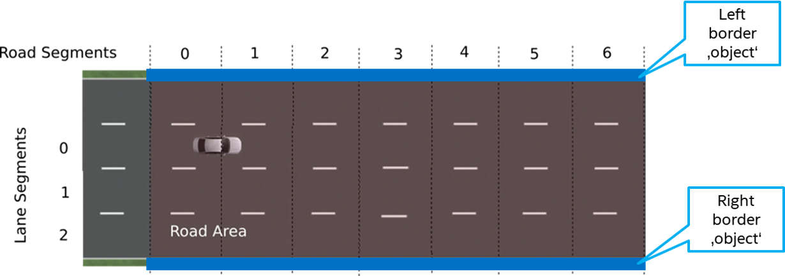

## Handling of road boundaries 

#### RSS and Evasive maneuvers
*If you can avoid an accident without causing another accident, you must do it.*

If a situation becomes dangerous and all vehicles respond properly according to
RSS, braking should always result in a safe state.
But what happens if others do not obey to the rules of RSS and braking will
not prevent from a collision anymore? There might be still a possibility to
escape from the dangerous situation. The [RSS paper](https://arxiv.org/abs/1708.06374)
proposes to perform a proper response with evasive effort: perform an maneuver
to evade the vehicle from the dangerous situation, respecting acceleration maxima
and proper responses to all other traffic agents.

RSS only defines behavior of interaction among vehicles and objects.
The initial implementation of RSS within *ad_rss* currently has no notion
of drivable freespace area. Hence, it cannot determine that an evasive maneuver
-- if initiated by RSS -- will cause an accident with an obstacle or forces
the vehicle to leave the road.

#### Stay on road
The integration of RSS with map data now opens up the possibility to get a description
of the road boundaries. To overcome the issue of leaving the road,
virtual objects can be added at the road boundaries. Then, these virtual objects
can be handled within *ad_rss* the same way as any other vehicle/object.
Thus, all RSS formulas are applied to these virtual objects, as well.
As a result, the vehicle will keep a minimum safe distance to all road boundaries
and stays on the drivable road.

|  |
| -- |
| *By adding the left and right border of the drivable road as artificial objects to the RSS scenes, RSS will ensure a safety distance to these virtual 'walls' and though make the vehicle to stay on its road.* |

#### Virtual road border objects
When adding the road boundaries to the list of RSS scenes, there is still the question
which borders to actually use. Do we want to restrict the vehicle to it's currently planned
route? Do we want to allow the vehicle to be able to enter the opposite lanes where
the speed difference towards other cars is expected to be much higher? Do we even want to
allow the vehicle to enter non-drivable lanes like shoulder lanes or even pedestrian ways?
As these questions may be answered differently in respect to the kind of road, the situation, etc.
*ad_rss_map_integration* allows the user to select between different modes  (ad::rss::map::RssSceneCreation::AppendRoadBoundariesMode) when calling
ad::rss::map::RssSceneCreation::AppendRoadBoundaries().

On the other hand, since the virtual objects are of static nature, the current implementation sets the ad::rss::world::RssDynamics of the road boundary objects to some fixed values: no acceleration, minimal response time, etc. The same is true for the breadth of the road boundaries, which are just fixed to 0.001 of the respective lane segment.
