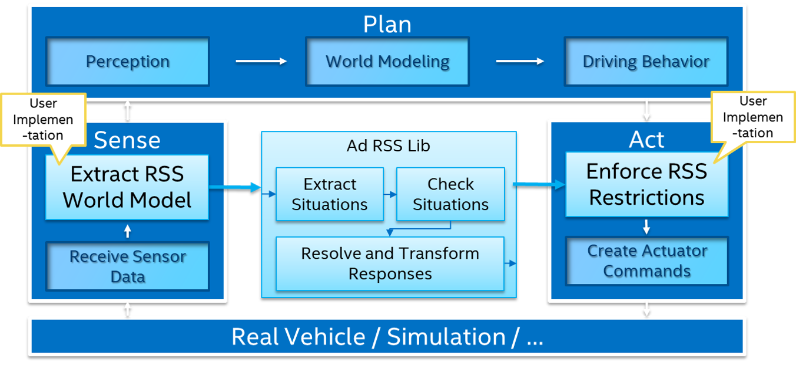

# C++ library for integrating Responsibility Sensitive Safety (RSS) with automated driving maps

#### Table of contents
1. [Introduction](#introduction)
2. [High Level Design](#highleveldesign)
3. [API documentation](#apidoc)
4. [Python Binding](#python)

## Introduction 
This *ad_rss_map_integration* library provides a C++ implementation for integrating Responsibility Sensitive Safety (RSS)
with automated driving maps. When RSS is to be integrated into a larger system it is usually up to
the user implementation to provide the required input into RSS based on the environment information
available within the system.

|  |
| -- |
| *Integration of RSS into an AD system with its general Sense, Plan and Act main components* |

To calculate such input to RSS, the `ad::rss::world::WorldModel`, usually a-priori knowledge on the environment
and especially on map information is required: Given the positions of all of the traffic participants,
a map matched position has to be calculated and a combination of route planning and prediction based
on the road topology has to be performed. Then, the route connecting the ego-vehicle and the
other vehicle has to be analyzed to deduce the kind of RSS-constellation between those two: driving on same road in same direction,
in opposite direction or being faced with an intersection with respective priority rules.
If the kind of constellation is derived, the relevant road areas and object/vehicle information have to be
transformed into the suitable world model format expected by the ‘C++ library for RSS’ (*ad_rss*) for further analysis.

These steps are not trivial. To enable the community to understand and evaluate RSS further,
this library provides an exemplary implementation of these steps. The implementation within
this library neither can be seen to be complete, fully correct or final,
nor it is claiming to be the only way of doing that. It's rather a piece of software required
to perform more thoroughly analysis within a simulation framework like
e.g. [CARLA driving simulator](https://carla.org).

This library makes use of the [*ad_map_access*](https://ad-map-access.readthedocs.io) interface
to interact with AD map data: read the AD map data from the
[OpenDRIVE](https://www.asam.net/standards/detail/opendrive/) maps provided with *CARLA*,
perform required matching, planning and analysis operations.

## High Level Design 
The high level design documentation provides more insights on the architecture and functionality
of this library.

1. [Construction of the RSS Constellations](./ConstructRSSConstellations.md)
2. [Handling of road boundaries](./HandleRoadBoundaries.md)

## API documentation 
Detailed documentation on API level is available via
[Doxygen](https://intel.github.io/ad-rss-lib/doxygen/ad_rss_map_integration/index.html)
documentation within the code.

## Python Binding 
There is also a python binding for the *ad_map_access* library available: [*ad_rss_map_integration_python*](./ad_rss_map_integration_python.md)
